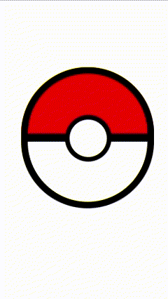
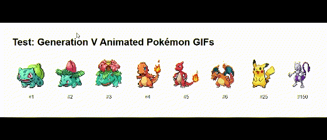
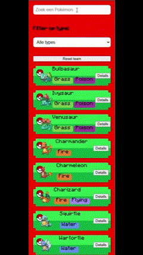
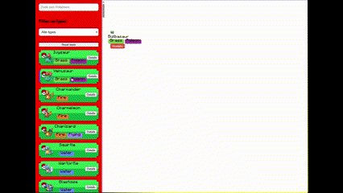
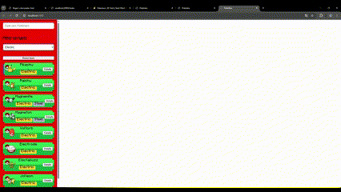
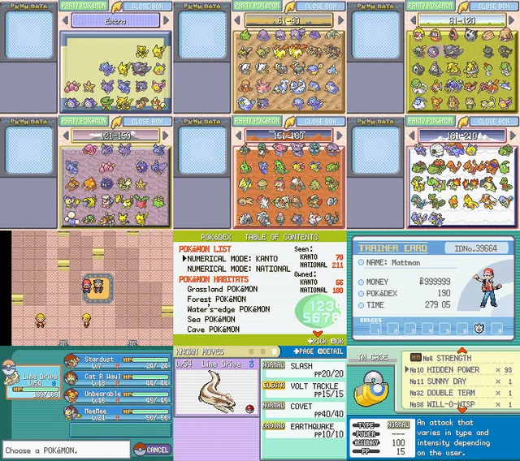
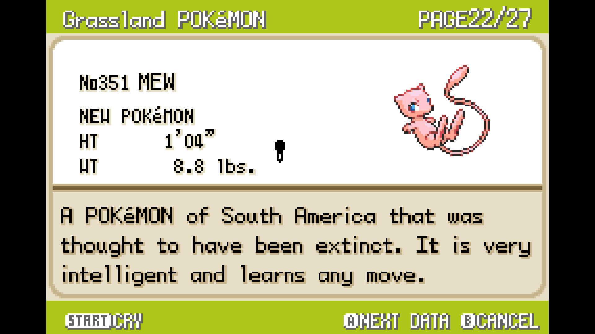
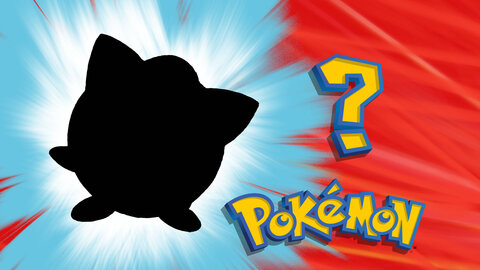
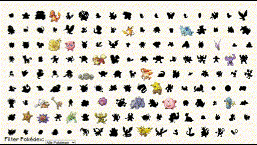
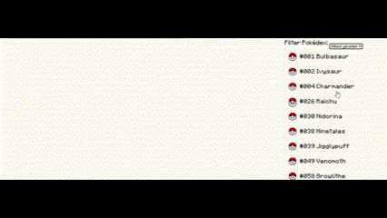

# API 24/25 Pokeguesser

## Week 1:
In week 1 heb ik mij gefocust op het maken van een plan, ik heb nagedacht over welke API ik wilde kiezen. Ik twijfelde over een boeken API, NS API, Weather API, Dragonball API en Pokemon API.
Ik ben begonnen met de dragonball API. Hier heb ik dus de namen van de dragonball characters kunnen laden in mijn website en ook de bijbehorende images. Maar al snel kwam ik erachter dat er niet heel veel informatie staat in de Dragonball API. Waar ik daarna heb gekeken was naar de pokéApi. De PokéApi had een veel betere structuur kwa informatie en gegevens. Ik kon dus veel meer doen met de pokéApi dan met de dragonball API. Mijn eerste idee is het maken van een pokedex. Het laten zien van de pokemons op naam en id die dan ook de types en informatie inlaad. 

## Week 2:
In week 2 heb ik verder gewerkt aan de pokedex. uit de pokeApi heb ik de animated gifs genomen door deze link te gebruiken: previewImg.src = `https://raw.githubusercontent.com/PokeAPI/sprites/master/sprites/pokemon/versions/generation-v/black-white/animated/${id}.gif`;

 Het idee die ik wil uitvoeren is het maken van een teambuilder app waar je pokemons in een team kan zetten om dan vervolgens een pokemon battle/ journey aan te gaan.

 Je kan nu pokemons toevoegen en verwijderen uit de team. ook heb ik een pokedex gemaken waar je de pokemons kan vinden. 

1. Hier zie je een pokeball waarbij de helft naar beneden gaat op hover.  

2. Hier heb ik getest om de pokemon gifs uit de API te halen.  

 3. Hier kan je dan filteren op naam en types van de pokemon.  
 

  4. Hier kan je de pokemons toevoegen en weer verwijderen uit je team.      
   

  5. Hier is het mogelijk om de team te resetten door middel van een knop.  

## week3:

In week 3 heb ik een beetje gepivot met mijn idee. ik vond het idee van een pokémon battle toch niet zo een leuk en gemotiveerd idee. Na lang onderzoek en kijken naar fotos heb ik inspiratie kunnen vinden. 

Hieruit heb ik drie functionaliteiten bedacht. 

1. Raad de pokemon  

2. pokemonlist  

3. pokedex  

## Week 4:

https://github.com/user-attachments/assets/b374e734-9ee6-4e8b-80e4-d54340b59dcb

<video src="./public/img/readme-img/intro.mp4">
