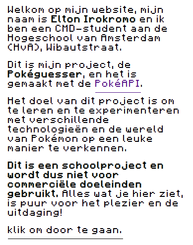
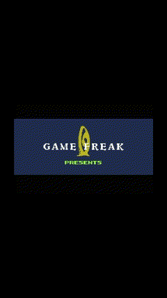
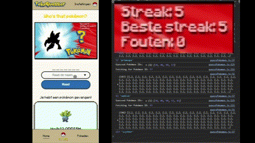
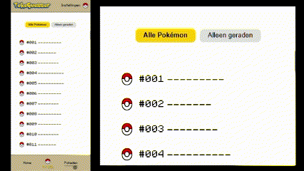
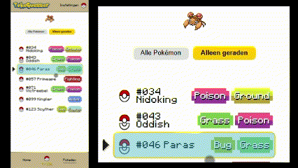
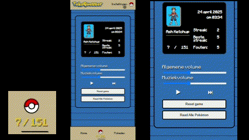
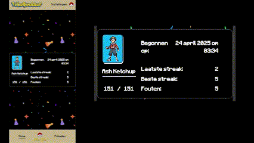

# API 24/25 Pokeguesser

## Week 1:
In week 1 heb ik mij gefocust op het maken van een plan, ik heb nagedacht over welke API ik wilde kiezen. Ik twijfelde over een boeken API, NS API, Weather API, Dragonball API en Pokemon API.
Ik ben begonnen met de dragonball API. Hier heb ik dus de namen van de dragonball characters kunnen laden in mijn website en ook de bijbehorende images. Maar al snel kwam ik erachter dat er niet heel veel informatie staat in de Dragonball API. Waar ik daarna heb gekeken was naar de pokéApi. De PokéApi had een veel betere structuur kwa informatie en gegevens. Ik kon dus veel meer doen met de pokéApi dan met de dragonball API. Mijn eerste idee is het maken van een pokedex. Het laten zien van de pokemons op naam en id die dan ook de types en informatie inlaad. 

## Week 2:
In week 2 heb ik verder gewerkt aan de pokedex. uit de pokeApi heb ik de animated gifs genomen door deze link te gebruiken: previewImg.src = `https://raw.githubusercontent.com/PokeAPI/sprites/master/sprites/pokemon/versions/generation-v/black-white/animated/${id}.gif`;

 Het idee die ik wil uitvoeren is het maken van een teambuilder app waar je pokemons in een team kan zetten om dan vervolgens een pokemon battle/ journey aan te gaan.

 Je kan nu pokemons toevoegen en verwijderen uit de team. ook heb ik een pokedex gemaken waar je de pokemons kan vinden. 

1. Hier zie je een pokeball waarbij de helft naar beneden gaat op hover.  

2. Hier heb ik getest om de pokemon gifs uit de API te halen.  

 3. Hier kan je dan filteren op naam en types van de pokemon.  
 

  4. Hier kan je de pokemons toevoegen en weer verwijderen uit je team.      
   

  5. Hier is het mogelijk om de team te resetten door middel van een knop.  

## week3:

In week 3 heb ik een beetje gepivot met mijn idee. ik vond het idee van een pokémon battle toch niet zo een leuk en gemotiveerd idee. Na lang onderzoek en kijken naar fotos heb ik inspiratie kunnen vinden. 

Hieruit heb ik drie functionaliteiten bedacht. 

1. Raad de pokemon, dit is een functie waarbij je een pokemon image krijgt die een filter van brightness="0" heeft. De value van de input staat gelijk aan de id en naam van de pokemon. Als dit goed is geraden dan zie je een popup van de pokemon met informatie erop. Zoniet dan krijg je een melding met "helaas je hebt niet goed geraden". De antwoorden worden opgeslagen in de localstorage.

2. Pokemonlist, hier laad ik in de pokemonlist alle images van de eerste generatie dus 151 pokemons. Deze images geef ik dan een brightness van 0. Wanneer je een pokemon goed hebt geraden dus "gevangen" dan komen deze tevoorschijn in je pokemonlist als de gif die ik haal uit de API. Zo kan je op een leuke manier je progressie bijhouden.  

3. Pokedex, de pokedex is een manier waarop je terug kan kijken naar je gevangen pokemon met daarop meerdere informatie van de pokemon zelf. je ziet alleen de pokemons die je hebt gevangen.   

## Week 4:
Week 4 heb ik anders aangepakt. ik heb op een rijtje gezet wat er allemaal moet gebeuren en zo heb ik stapsgewijs gewerkt.

### Intro
1. Ik heb een disclaimer gemaakt om te zeggen dat dit een schoolproject is en dat dit niet gebruikt word voor commerciele doeleinden.   

2. De intro begin je met het klikken om door te gaan en dan start de intro van de gameboy pokemon fire red af. Dit kan je ook skippen door spatie of klik.   

3. Door te klikken of op spatie kan je doorgaan naar de volgende pagina.  

### Username
Wanneer je voor het eerst de index pagina binnenkom dan heb je de keuze tussen de 3 generaties van pokemon. en dus ook de keuze tussen hoeveel pokemons je moet raden. 151, 100, 134 pokemons. 

Je kan ook kiezen tussen een jongen of meisjes karakter en die kan je dan ook meteen een naam geven. Na submit worden je gegevens opgeslagen en ook de datum wanneer je dit aanmaak, ook word de pagina daarna herladen om de pokemons van de juiste generatie in te laden.

1. 151 pokemons worden ingeladen van de eerste generatie  
 

2. 100 pokemons worden ingeladen van de tweede generatie   

3. 134 pokemons worden ingeladen van de derde generatie  

### guessPokemon
In de console log kan je zien welke pokemon het goede antwoord is. Wanneer je een pokemon goed hebt geraden dan krijg je een kaart van de pokemon die je hebt "gevangen". Er wordt bijgehouden of je een antwoord goed of fout hebt. Zo zie je dan ook hoeveel fouten je hebt gemaakt, hoeveel goed je achter elkaar hebt gehaald en wat je beste streak is geweest zonder fouten. 
1. Guesspokemon  

2. Hier wordt de streak bijgehouden.  

3. Hier worden de fouten bijgehouden  

4. Hier zie je dat de streak weer begint vanaf 0  

### pokemonlist en pokedex
In de pokemonlist en pokedex komen nog steeds de pokemons die je goed hebt geraden in. Ik heb nu een betere UI gemaakt zodat het wat makkelijker en overzichtelijker is om de pokemonlist en pokedex te besturen. Je kan nu in de pokemonlist op pagina selecten of all pokemons. dit zorgt ervoor dat je maar 24 pokemons per pagina te zien krijgt. Daarnaast kan je dan ook filteren op geraden pokemons in de pokemonlist en pokedex.

1. 
2. 

### dev functies
Als laatste heb ik developers functies gemaakt zoals de raad alle pokemons knop. het is een cheat button om zo gemakkelijker de winner container te designen. Je kan dan ook meteen testen op alle pokemons en kijken of je ook daadwerkelijk alle data van de juiste pokemons beschikbaar hebt gesteld. 

Wanneer je hebt gewonnen wil je natuurlijk een prijs of een bewijs dat je het hebt gewonnen. zo bedacht ik me dus om een kaartje te maken met daarop de gegevens die is bewaard van je voortgang. Dit leek me leuk voor de gebruiker om terug te kijken naar hun ervaring. En misschien dat zij hierop ook willen verbeteren om dan voor de 0 fouten te gaan. 

1. 
2. 
3. 

